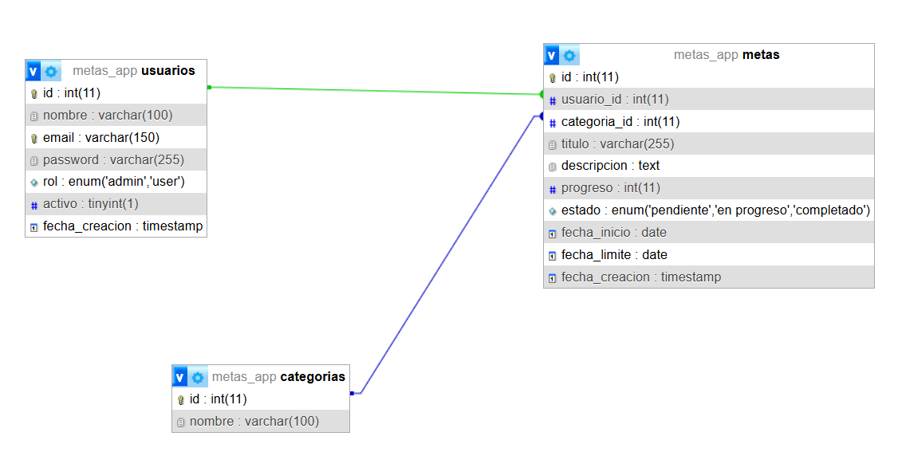

# Metas API 

API REST robusta desarrollada con **FastAPI** para la gestión de metas y objetivos.
Implementa una arquitectura relacional en **MySQL**, seguridad mediante hashing de contraseñas y un sistema de control de acceso basado en roles (**RBAC**).

---

##  Características Técnicas

*  **Autenticación Basada en Headers**: Validación mediante `x-user-id` y `x-rol`.
*  **Seguridad**: Hashing de contraseñas con **bcrypt** (salt automático).
*  **Middleware Global**: Procesamiento de peticiones para inyectar el estado del usuario.
* **Lógica de Negocio**: Actualización automática de estados basada en el progreso (0–100%).
*  **Consultas Optimizadas**: Uso de `INNER JOIN` y `LEFT JOIN` para obtener datos completos en una sola petición.
##  Tecnologías y Librerías

* **Python** 3.10+
* **FastAPI**: Framework web de alto rendimiento
* **PyMySQL**: Conector de base de datos
* **Pydantic**: Validación de datos (Data Integrity)
* **Bcrypt**: Encriptación de seguridad
* **MySQL / XAMPP**: Motor de base de datos relacional

---


## Requisitos previos

- Python 3.10+ instalado
- XAMPP ejecutándose (Apache y MySQL activos)
- `requirements.txt` disponible

---

## Instalación

```bash
git clone https://github.com/SaulVVelazquez/metas_app.git
cd metas_app
python -m venv venv
source venv/bin/activate  # En Windows: venv\Scripts\activate
pip install -r requirements.txt
```

---

## Configuración de base de datos

Importa el archivo `base.sql` en tu servidor MySQL.
```sql
-- base.sql contiene:
-- • Base de datos: metas_app
-- • Tablas: usuarios, categorias, metas
```
### Estructura de tablas:

* **usuarios**: Gestión de perfiles y roles
* **categorias**: Diccionario de etiquetas para metas
* **metas**: Tabla principal con llaves foráneas hacia usuarios y categorías
---

## Esquema de base de datos

### `usuarios`

| Campo | Tipo | Descripción |
|-------|------|-------------|
| id | INT (PK) | Identificador único |
| nombre | VARCHAR | Nombre completo |
| email | VARCHAR (UNIQUE) | Correo electrónico |
| password | VARCHAR | Hash Bcrypt |
| rol | VARCHAR | `admin` o `user` |

### `categorias`

| Campo | Tipo | Descripción |
|-------|------|-------------|
| id | INT (PK) | Identificador único |
| nombre | VARCHAR | Nombre categoría |

### `metas`

| Campo | Tipo | Descripción |
|-------|------|-------------|
| id | INT (PK) | Identificador único |
| usuario_id | INT (FK) | Referencia usuarios |
| categoria_id | INT (FK) | Referencia categorías |
| titulo | VARCHAR | Descripción breve |
| descripcion | TEXT | Detalle completo |
| progreso | INT (0-100) | Porcentaje avance |
| estado | VARCHAR | `pendiente`, `en progreso`, `completado` |
| fecha_inicio | DATE | Inicio objetivo |
| fecha_limite | DATE | Fecha máxima |

---

## Relaciones

- **Usuarios → Metas**: 1:N (un usuario, múltiples metas)
- **Categorías → Metas**: 1:N (una categoría, múltiples metas)
## Esquema de Base de Datos (ERD)


---

La API utiliza un middleware personalizado que intercepta cada llamada (excepto rutas públicas) para verificar los headers de identidad:

```python id="p8s9dl"
# Inyección de identidad en el estado de la petición
request.state.user_id = int(user_id)
request.state.rol = rol
```

### Rutas Públicas

* `/`
* `/login`
* `/register`
* `/docs`
* `/openapi.json`

##  Endpoints Actualizados

###  Autenticación e Identidad

| Método | Endpoint    | Descripción                                     |
| ------ | ----------- | ----------------------------------------------- |
| POST   | `/register` | Crea usuario con password hasheado              |
| POST   | `/login`    | Valida credenciales y retorna headers de sesión |
| GET    | `/me`       | Retorna el perfil del usuario autenticado       |

---

###  Gestión de Metas

| Método | Endpoint      | Descripción                                       |
| ------ | ------------- | ------------------------------------------------- |
| GET    | `/metas`      | Lista metas (Admin ve todas, User solo las suyas) |
| POST   | `/metas`      | Crea meta vinculada al ID del header              |
| PUT    | `/metas/{id}` | Actualización completa con validación de dueño    |
| DELETE | `/metas/{id}` | Eliminación física de registros                   |

---

###  Administración y Dashboard (Solo Admin)

| Método | Endpoint         | Descripción                       |
| ------ | ---------------- | --------------------------------- |
| GET    | `/stats`         | Estadísticas globales del sistema |
| GET    | `/usuarios`      | Listado de usuarios registrados   |
| DELETE | `/usuarios/{id}` | Remover cuentas del sistema       |
| POST   | `/categorias`    | Crear nuevas categorías dinámicas |

##  Reglas de Validación (Pydantic)

*  **Email**: Formato válido (`EmailStr`)
*  **Password**: Mínimo 6 caracteres
*  **Progreso**: Entero entre 0 y 100
*  **Fechas**: `fecha_inicio` no puede ser mayor a `fecha_limite`

---

##  Ejecución

Para iniciar el servidor en modo desarrollo:

```bash id="r3n8tx"
uvicorn main:app --reload
```

La documentación interactiva estará disponible en:
👉 http://localhost:8000/docs

## Notas

Proyecto técnico con validación de conexión MySQL en `test.py`.


